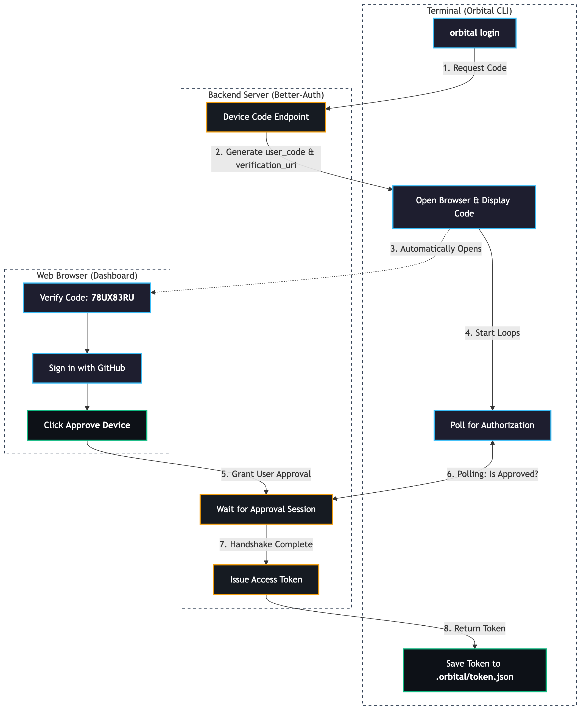

# Orbital

Orbital is an AI-powered toolchain and workflow system that integrates local terminal operations with advanced AI assistance. It consists of a Node.js backend providing a high-performance CLI, paired with a Next.js web application handling authentication and device approval workflows.

## Architecture

To review the detailed device approval and layout flow used by Orbital sessions, see the architecture diagram below:



## Repository Structure

The project is split into two primary folders:

-   **/server**: Houses the Node.js Express Backend, DB Prisma instances, and the `orbital-cli` tool binary algorithms scripts layouts layouts framing specs setups framing.
-   **/client**: Houses the Next.js Frontend server providing device OAuth credentials approval page rendering.

---

## Features

### AI Terminal Operations
*   **Standard Chat Mode**: Pure dynamic AI interactions backed by Vercel AI SDK setups formats specs standards.
*   **Tool Calling Mode Mode**: Access live contextual loops framing configurations designs datasets standardspecs framing formats loops.
    *   **Google Search**: Fetch up-to-date data.
    *   **Code Execution**: Run secure Python blocks calculations setups logic.
    *   **URL Context Analyst**: Process specific hyperlinks inside replies replies setups logic.
    *   **API Key Storer**: Automatically writes token configuration maps lists into local workspace `.env` setups frameworks specs rules formats layouts framing.

### Device Approval Onboarding Flow
*   Seamless terminal-to-web authentication flow designed layouts setups framing triggers loops structures.

### Custom Prompt Tool Execution Sub-agent
*   *Coming Soon*

---

## Getting Started

### Prerequisites
*   Node.js (v18+)
*   PostgreSQL running DB node instances.
*   Gemini API Key setups framing specs credentials.

### Installation

1.  **Clone the Repository**
2.  **Environment Setup**:
    *   Inside `/server`, create a `.env` file containing:
        ```text
        DATABASE_URL="postgresql://..."
        GOOGLE_GENERATIVE_AI_API_KEY="AI..."
        ```
3.  **Setup and Run (Backend)**:
    ```bash
    cd server
    npm install
    npx prisma db push
    npm run dev
    ```
4.  **Setup and Run (Frontend)**:
    ```bash
    cd ../client
    npm install
    npm run dev
    ```

---

## Operating the CLI

To test the CLI on your local file tree while developing, you can link the binary using Node execute prompts or trigger methods:

1.  **Login Syncing**
    ```bash
    orbital login
    ```
    *(Opens your browser to verify code approvals)*

2.  **Toggle Chatting Session**
    ```bash
    orbital wakeup
    ```

3.  **Modify Tools Switch Modulo**
    Inside a Tool-Calling Chat session loop interface prompts setups framing descriptions rules framing, type `/tools` to update dynamic active module list triggers specs setups specifications frames.
